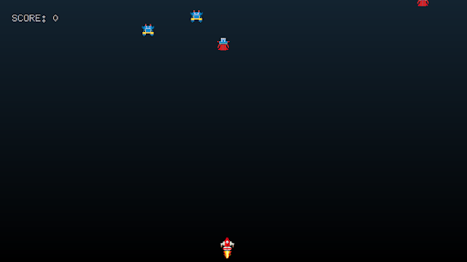

# 🚀 Pixel Orbit (v1.0)

  

**Pixel Orbit** is a retro-style arcade space shooter developed using **C++** and the **Qt 6** framework. The game features fluid movement and real-time score tracking, utilizing **QML** for a modern, hardware-accelerated user interface.

## 🕹️ Gameplay & Controls
- **Objective:** Control your ship, destroy falling alien enemies, and survive as long as possible.
- **Move:** Use the **Arrow Keys** (Left/Right/Up/Down) to navigate.
- **Fire:** Press the **Spacebar** to shoot at enemies.
- **Score System:** Track your performance in real-time as you clear waves.

## 🛠️ Tech Stack & Key Features
- **Core Engine:** Developed in **C++** using Object-Oriented Programming (OOP) principles.
- **UI/UX:** Built with **Qt Quick (QML)** for high-performance graphics and animations.
- **Architecture:** Efficient integration between C++ backend logic and QML frontend.
- **Build System:** Managed via **CMake** for modern C++ standards.

## 📁 Project Structure
- `Controller.cpp/h`: Manages the game flow and main logic.
- `Enemy.cpp/h/qml`: Handles enemy behavior and visuals.
- `Bullet.cpp/h/qml`: Manages projectile physics and collisions.
- `assets/`: Contains all sprites and graphical resources.

## 🏁 How to Build and Run
1. Ensure you have **Qt 6** and **CMake** installed.
2. Clone this repository: `git clone https://github.com/spiritu2/Pixel-Orbit.git`
3. Open `CMakeLists.txt` in **Qt Creator**.
4. Configure the project and click **Run**.

---
*Developed by Pedro Biscalchin Marconato - Computer Engineering Student.*
